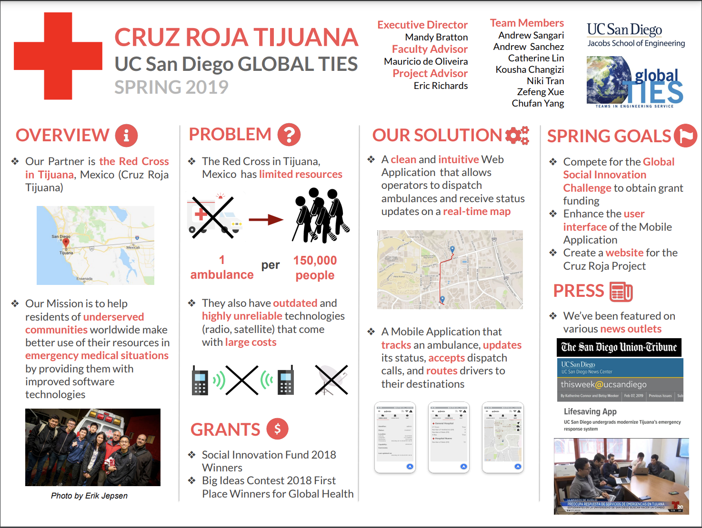
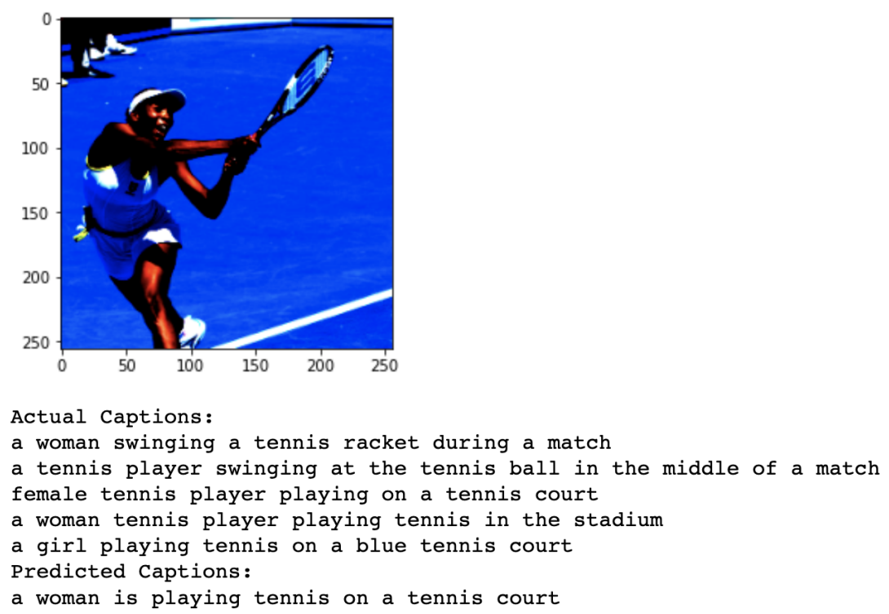

# About Me

I got my B.S. degree in Computer Science from University of California, San Diego in June 2021. I am currently a full-time researcher at the Salk Institute of Biological Science, doing research on sleep using Machine Learning techniques. Throughout my research, I have developed a better understanding of the impact of Computer Science and more specifically, Artificial Intelligence, on science and the future world. That is when I discovered my passion for this field and decided to continue my education by pursuing a PHD. 

# Education

* <b> University of California, San Diego </b>
  * B.Sc. Computer Science, Cognitive Science Minor
  * Class of 2021
  * GPA; 3.84
  * Honors; Cum Laude

* <b> De Anza College </b> 
  * Associate Degree in Computer Science
  * Class of 2018

# Research Experiences

* <b> Salk Institute of Biological Science </b>
  * AI Research Scientist / Data Analyst
  * Sep. 2020 – Present	        
  * Processing the EEG and EMG signals of 11 mice to study their sleep patterns. In order to study the patterns, we are developing a network using Deep Learning to predict mice Sleep/Wake and REM/NREM sleep status based on their EEG and EMG signals. In addition, we are using K-means clustering to analyze NREM subcategories in different biological experiments. 

* <b> MyCircadianClock Mobile App </b>
  * Software Engineer / Data Analyst
  * Sep. 2021 – Present
  * [https://mycircadianclock.org/](https://mycircadianclock.org/).
  * Working in a team to design and develop a health app for both Android and IOS that tracks users’ daily activity, sleep, and eating schedule. Within the research we are analyzing the effect of biologic rhythm on various diseases using the data collected from the users. We are using Django as the app development framework and PostgreSQL for the database management.

# Class Projects

* <b> Cruz Roja Emergency Response System </b>
  * Red Cross Tijuana / UCSD
  * Winter’19 & Spring’19
  * [https://globalties.ucsd.edu/what/projects/cruz-roja-tijuana.html](https://globalties.ucsd.edu/what/projects/cruz-roja-tijuana.html)
  * Worked in a team of 8 to develop an Android app and a website, which Red Cross ambulances currently use to improve their response time in Tijuana. To do that, we created the mobile app using Android Studio and the website using Django.
  * NBC San Diego's news report: [https://www.nbcsandiego.com/news/local/ucsd-students-modernize-tijuanas-emergency-response-system/2089/](https://www.nbcsandiego.com/news/local/ucsd-students-modernize-tijuanas-emergency-response-system/2089/) 
  *Final presentation:

* <b> Image Captioning Using an LSTM Network </b>
  * UCSD
  * Fall’20
  * Worked with 3 other students to build an encoder-decoder architecture in PyTorch for image captioning using the dataset from the COCO repository. We used CNN to encode the images, and Recurrent Neural Network (LSTM) to generate the captions. At the end, we quantified the quality of text generation by calculating BLEU scores.
  * An example of the image captioning: 

* <b>Gomoku Auto-Play Using AI </b>
  * UCSD
  * Spring’20
  * Designed an algorithm in Python to play Gomoku, an abstract strategy board game, to play against human agent, using a custom Monte Carlo tree search in Python to make probabilistic decisions. 

* <b> Exercise Tracker for Android Phones </b>
  * UCSD
  * Winter’21
  * Designed and implemented a workout Android app with 5 other students. For this project, we used Android Studio to implement the UI, Firebase to manage the backend, and Google Fit API to track the user’s exercise. The app had programmed features such as: tracking daily exercises, scheduling a walk, connecting to other users.

* <b> Deep Convolutional Network for Bird Classification </b>
  * UCSD
  * Fall’20
  * Implemented a custom CNN architecture to classify North American birds, in a team of 3 students. We used the Caltech-UCSD Birds dataset, containing 12,000 images of 200 categories, to train the network. To achieve the best result, we experimented Max-pooling, Batch normalization, and Cross-entropy loss. 

* <b> Minimum Wage vs. Inflation Data Analysis </b>
  * UCSD	                
  * Fall’19
  * Analyzed the effect of minimum wage on inflation rates in California, in a team of 3 students, based on the monthly data from 1976-2017. We pre-processed the data using Panda and NumPy in Jupyter Notebook framework, in addition to using statistical packages, such as Patsy and SciPy, to measure and describe the correlation between minimum wage and inflation.  

# Teaching Experience

* <b> UCSD CSE Department </b>
  * Served as an undergraduate tutor for the following courses:
    * CSE 103: A Practical Introduction to Probability and Statistic
    * CSE 101: Design and Analysis Algorithm
    * CSE 140: Components and Design Techniques for Digital Systems
    * CSE 21: Mathematics for Algorithms and Systems
  * More descriptions can be found in the following link: 
  * [https://catalog.ucsd.edu/courses/CSE.html](https://catalog.ucsd.edu/courses/CSE.html)

 * <b> De Anza College CIS Department </b>
  * TA of CIS 22A (Introductoni to C++) for two quarters.  

# Skills
* <b> Languages </b>: C/C++, Java, Python 3, ARM Assembly
* <b> Machine Learning Packages </b>: Scikit-Learn, PyTorch, NumPy, Pandas, Matplotlib, Seaborn, SciPy, Patsy
* <b> Data Science </b>: Data Visualization, Data Pre-Processing, Jupyter Notebook
* <b> App Development </b>: Android Studio, DJango, Firebase, Espresso, Docker, Google Fit API, PostgreSQL
* <b> Project Management </b>: Agile Software Process, SCRUM

# Skills
* <b> Deep Learning </b>: Applied Neural Network algorithms in multiple datasets
* <b> Data Science </b>Worked on a real-life data science project 
* <b> Supervised Machine Learning </b>: Analyzed the mathematics behind machine learning algorithms
* <b> Search and Reasoning in AI </b>: Applied search and reasoning algorithms to various types of games 
* <b> Software Engineering </b>: Developed the frontend and backend of an Android fitness app 
* <b> Project Management </b>: Learned principles of project management including Agile management 
* <b> Principal Intro to Statistics and Probability </b>: Studied the fundamentals of statistic and probability 
* <b> Design and Analysis of Algorithms </b>: Learned about fundamental algorithms in Computer Science

# Hobbies
* Some of my favorite activities :)

